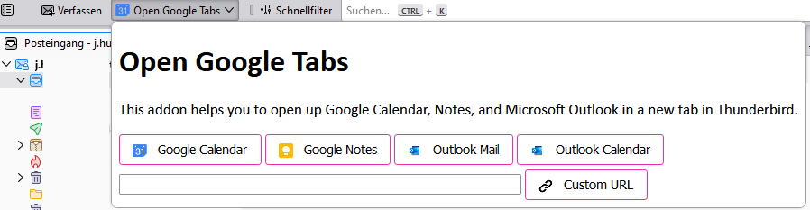

# Thunderbird Tabs

Very basic tabs addon for opening Google, Outlook, or other web applications in Thunderbird Tabs. It works with Thunderbird Supernova (115.*+) and uses only Thunderbird 68 and higher APIs--no legacy stuff.

Download here: https://addons.thunderbird.net/de/thunderbird/addon/open-google-tabs/

General information about Thunderbird supernova (115.*+):
https://developer.thunderbird.net/add-ons/updating/tb115

## Screenshot

Screenshot of the menu.

